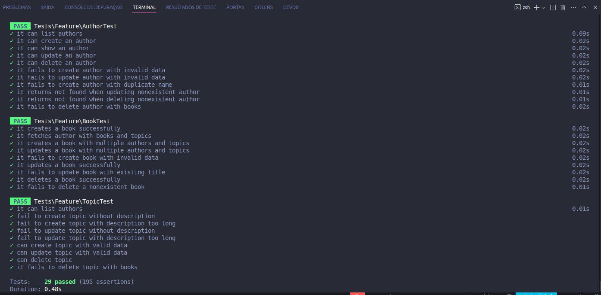
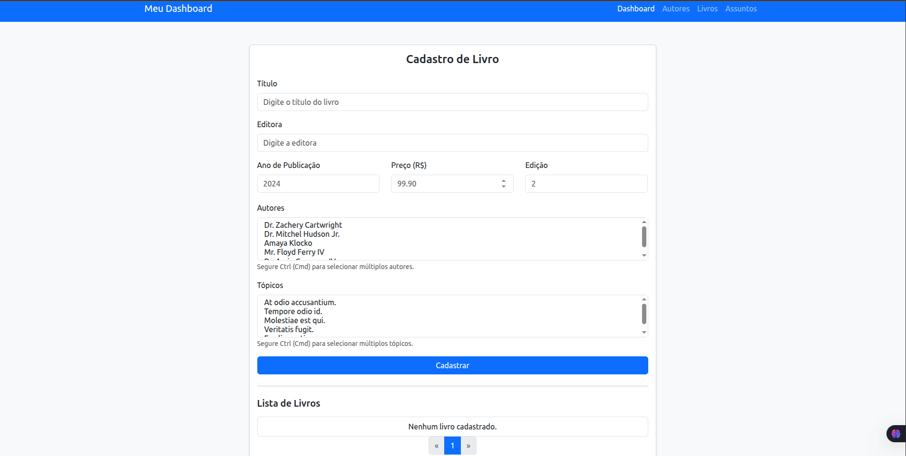

#Projeto
Este é um guia passo a passo para configurar e executar o projeto localmente usando Docker.

Pré-requisitos
Docker Desktop instalado e configurado na sua máquina.
Git instalado na sua máquina.
Instalação
Clone o repositório do projeto do GitHub:

```
git clone https://github.com/newtoncutrim/teste-spassu.git
```
Navegue até o diretório do projeto clonado:
```
cd teste-spassu
```
Execute o seguinte comando para iniciar os contêineres Docker e construir as imagens:
```
make setup
```
Configure o banco de dados no arquivo .env com as seguintes credenciais:
```
DB_CONNECTION=mysql
DB_HOST=db
DB_PORT=3306
DB_DATABASE=laravel
DB_USERNAME=root
DB_PASSWORD=root
```
Execute as migrações do banco de dados com o seguinte comando:
```
make migrate
```
Execute os teste da api com o seguinte comando:
```
make test
```

Acesso Local
Depois de seguir as etapas acima, você pode acessar o projeto teste-spassu localmente no seguinte endereço:

http://localhost:9000/


## 🖼️ Screenshots

### Testes


### Livros


### Relatorio
